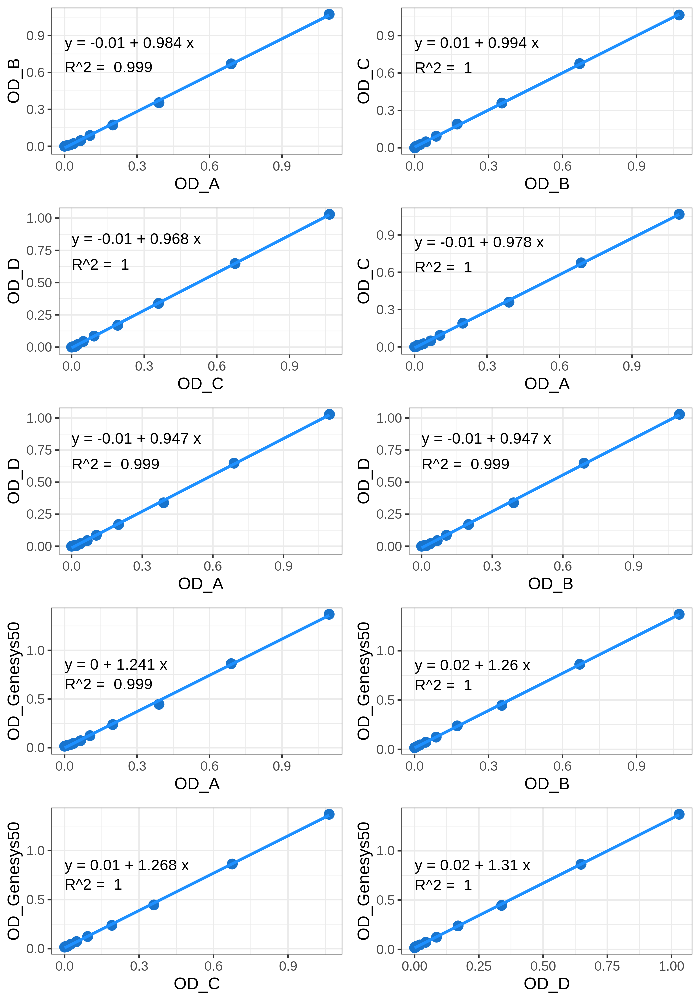
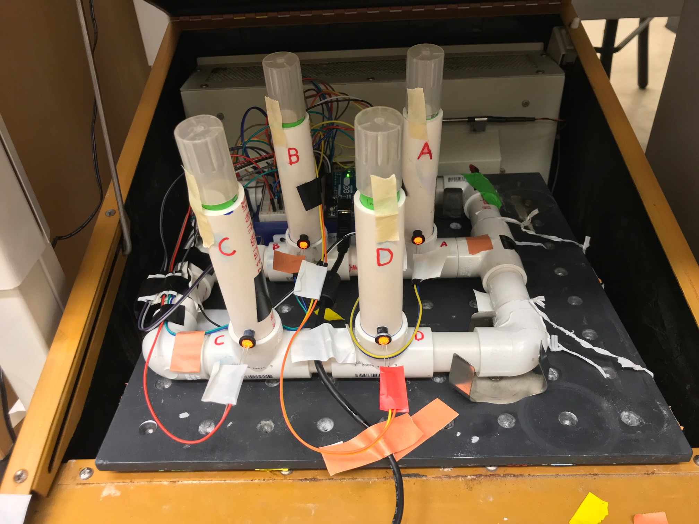
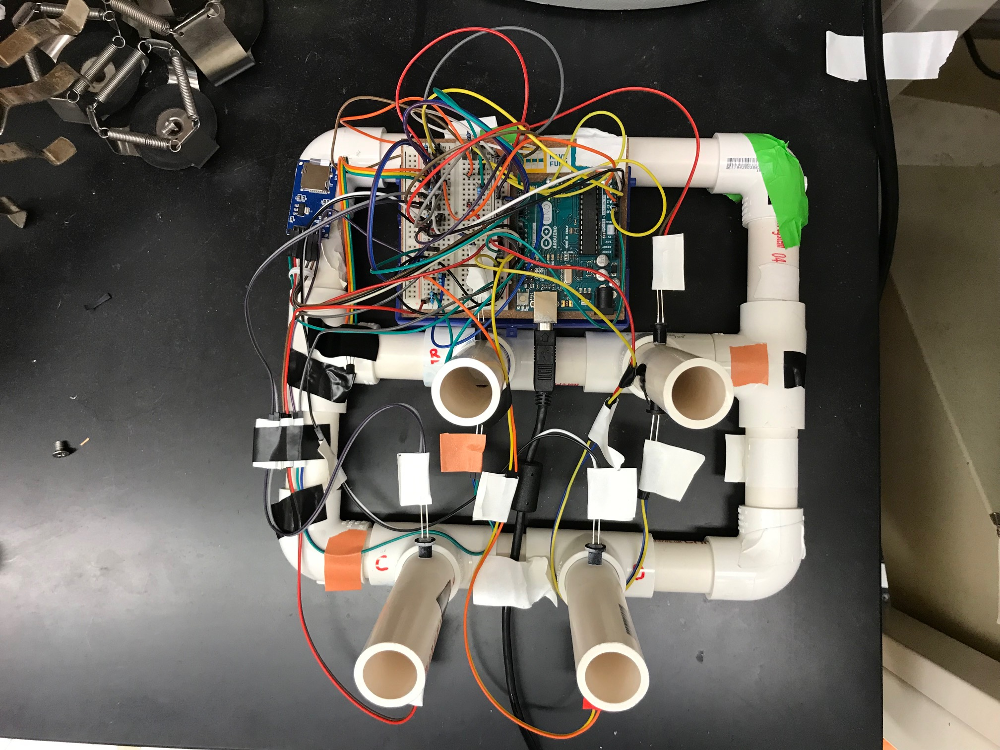

# ODroid600

The motivation behind this tool came from the inconvenience of having
to obtain repeated bacterial growth curve measurements coupled with the fact that the spectrophotometer in my graduate research lab was broken and I needed to make measurements. I happened to realize that Pyrex 9820 glass test tubes (25 mm outer diameter) fit well inside schedule 40 PVC piping (). Thus my goal was to use a scaffold of PVC with low-cost electronic components to create an automated spectrophotometer. Additionally, so called "inexpensive" devices that were being marketed were still in the price range of several thousand dollars and thus still inaccessible to low-budget laboratories.

## Components
|Component| Quantity | Price |  Link |
| --------|----|----|-------|
| 3/4 inch PVC pipe |
| 3/4 inch PVC T coupler | 6 | $10.14 | https://www.acehardware.com/departments/plumbing/pipe-fittings/plastic-fittings/43137
| 3/4 inch PVC elbow coupler | 4 | $3.16 | https://www.acehardware.com/departments/plumbing/pipe-fittings/plastic-fittings/43123 |
| Flanged nylon bushing (Hillman Group #58071 [0.312 O.D.])| 4 | $10.99 (40 pack) | https://www.amazon.com/B00MNDPO26 |
| Arduino UNO REV3 | 1 | $28.50 | https://www.amazon.com/dp/B008GRTSV6 |
| Breadboard | 1 | $9.99 | https://www.amazon.com/dp/B07LFD4LT6 |
| Assorted resistors | 1 kit | $11.99 | https://www.amazon.com/dp/B072BL2VX1 |
| Jumper wires |  |  |  |
| Orange LEDs (602-610 nm) | 4 | $6.99 (for 100) |  https://www.amazon.com//dp/B077XD7MVB |

Note: some of the above components are sold in large quantites and can be used to make more than one ODroid600
Total Cost: $X

Tools needed:
PVC cutter or hacksaw
Drill with 1/4 inch drill bit

## Assembling base
1) Cut the following lengths and quantities of PVC for each frame component:
side pieces: x inches (2 total), x inches (2 total)
rear piece: x inches
tube stalk connectors: x inches (2 total), x inches (2 total), x inches (2 total)
2) Assemble the base according to the diagram below. The pieces should fit snugly together without the need for any glue or adhesive.

## Assembling tube stalks
1) Cut PVC pipe to 4.75 inches
2) Place the cut stalk in a PVC T and mark holes to drill 0.375 inches (~1cm) from the junction between the T and tubing (Tip: Use the centering line on the T to make sure drill hole markings are aligned on either side of the pipe)
3) Remove the cut stalk from the PVC T and carefully drill the marked holes ensuring as best as possible to have the two holes aligned. If needed, file away excess PVC debris from the drilled holes.
Use 1/4 inch drill bit to drill holes on either side.
4) Place the ACE adapters in each of the drilled holes so that the bottom edge aligns with the inner diameter of the PVC pipe
5) Place the holding stalk within a T of the base
6) Repeat for the 3 other test-tube holding stalks
7) Ensure that the ACE adapters are at the same height above the T adapter in each holding stalk

## Comparison with GENESYS 50 spectrophotometer

First a bacterial suspension of *Pseudomonas putida* 1290 made in a plastic cuvette to 1.0 OD using the Genesys 50 spectrophotometer. The bacterial suspension was serially diluted 2-fold a total of 10 times in 50 mL Falcon tubes. A Pyrex 9820 test tube was placed inside each of the ODroid600 holders as well as in the test tube holding attachment for the Genesys 50 spectrophotometer. Then the serially diluted samples were successively dispensed and moved from each sensor to obtain a reading (1 channel in the Genesys 50 spectrophotometer and 4 channels in the ODroid600). Sample absorbance was read successively from the most diluted sample to the least diluted (i.e. the original bacterial suspension). All tubes were left inside their respective holding chambers (tube stalks of the ODroid600 or the test tube holding attachment for the Genesys 50 spectrophotometer) in order to minimize errors or confounding factors that occur from repositioning the test tubes in the different instruments. The only thing that changed in the experiment was the solution inside the test tubes. The analog phototransistor readings from each channel of the Arduino on the ODroid600 were obtained using the serial monitor within the Arduino IDE software. The phototransistor values from the sample dilutions were transformed to optical density using the following formula: -log10(sample_value/blank_value).

